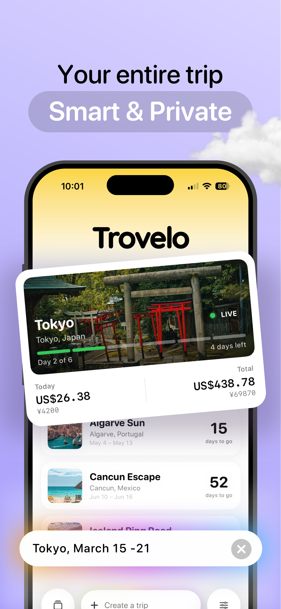

# pinilloslab.com

Personal website and app portfolio for Eduardo Pinillos.  
Hosted on GitHub Pages at [pinilloslab.com](https://pinilloslab.com)

---

## File Structure

```
├── index.html                    ← Main website
├── images/
│   ├── avatar.svg                ← About Me illustration
│   ├── trovelo-1.webp            ← App screenshots (add your own)
│   ├── trovelo-2.webp
│   ├── dimmly-1.webp
│   └── ...
├── blog/
│   ├── trovelo/
│   │   ├── index.html            ← Trovelo blog listing
│   │   └── my-post-slug.html     ← Individual posts
│   ├── dimmly/
│   │   ├── index.html
│   │   └── ...
│   ├── percha/
│   │   ├── index.html
│   │   └── ...
│   └── solid/
│       ├── index.html
│       └── ...
└── README.md
```

---

## How to Manage Content (via GitHub Web Editor)

### Add a New Blog Post

1. Go to the `blog/trovelo/` folder (or whichever app)
2. Click **Add file → Create new file**
3. Name it with a slug: `my-post-title.html`
4. Copy the contents of an existing post (like `smart-activity-cards.html`) as your template
5. Edit the sections marked with `✏️ EDIT`:
   - `<title>` — your post title for SEO
   - `<meta name="description">` — short description for Google
   - `<link rel="canonical">` — full URL of the post
   - `<span class="post-tag">` — category: Tips, Update, or News
   - `<h1 class="post-title">` — the visible title
   - `<span class="post-date">` — publication date
   - `<article class="post-body">` — your content (use `<p>`, `<h2>`, `<h3>`, `<ul>`, `<blockquote>`, `<strong>`)
6. **Don't forget** to add the post to the blog's `index.html` listing:
   - Open `blog/trovelo/index.html`
   - Copy an existing `<a class="blog-post-item">` block
   - Update the href, date, title, excerpt, and tag
   - Put newest posts at the top

### Update App Screenshots

1. Go to the `images/` folder
2. Click **Add file → Upload files**
3. Upload your WebP/PNG screenshots
4. Open `index.html` and find the app's `<div class="app-screens">` section
5. Replace placeholder `<div>` elements with:
   ```html
   <div class="app-card">
     
   </div>
   ```

### Edit a Privacy Policy

1. Open `index.html`
2. Search for the app's privacy page ID (e.g., `trovelo-privacy-page`)
3. Edit the text directly inside the `<div class="privacy-content">` section
4. Commit changes

### Update App Descriptions

1. Open `index.html`
2. Search for `app-description` to find each app's description section
3. Edit the `<p class="app-desc-text">` paragraphs
4. Use `<strong>` for bold keywords, regular text stays gray

---

## Writing Blog Posts — HTML Cheatsheet

```html
<!-- Paragraph -->
<p>Your text here. Use <strong>bold</strong> for emphasis.</p>

<!-- Heading -->
<h2>Section Title</h2>
<h3>Subsection Title</h3>

<!-- List -->
<ul>
  <li><strong>Item</strong> — description</li>
  <li><strong>Item</strong> — description</li>
</ul>

<!-- Quote -->
<blockquote>
  <p>"Quoted text goes here."</p>
</blockquote>

<!-- Image (place in images/ folder first) -->


<!-- App Store CTA (already in template) -->
<div class="post-cta">
  <p class="post-cta-title">Try Trovelo Free</p>
  <p class="post-cta-sub">Your tagline here.</p>
  <a href="https://apps.apple.com/app/id..." class="post-cta-link">Download on the App Store</a>
</div>
```

---

## GitHub Pages Setup

1. Go to your repo **Settings → Pages**
2. Source: **Deploy from a branch**
3. Branch: `main`, folder: `/ (root)`
4. Custom domain: `pinilloslab.com`
5. Check **Enforce HTTPS**

### DNS Configuration (at your domain registrar)

| Type  | Name | Value                          |
|-------|------|--------------------------------|
| CNAME | www  | yourusername.github.io         |
| A     | @    | 185.199.108.153                |
| A     | @    | 185.199.109.153                |
| A     | @    | 185.199.110.153                |
| A     | @    | 185.199.111.153                |

---

## Tech Stack

- Pure HTML/CSS/JS — no frameworks, no build step
- GitHub Pages — free hosting
- Web3Forms — contact form
- All apps: 100% on-device, privacy-first
